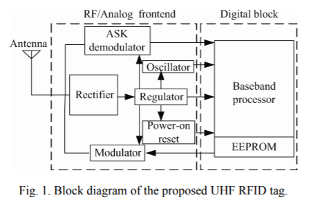
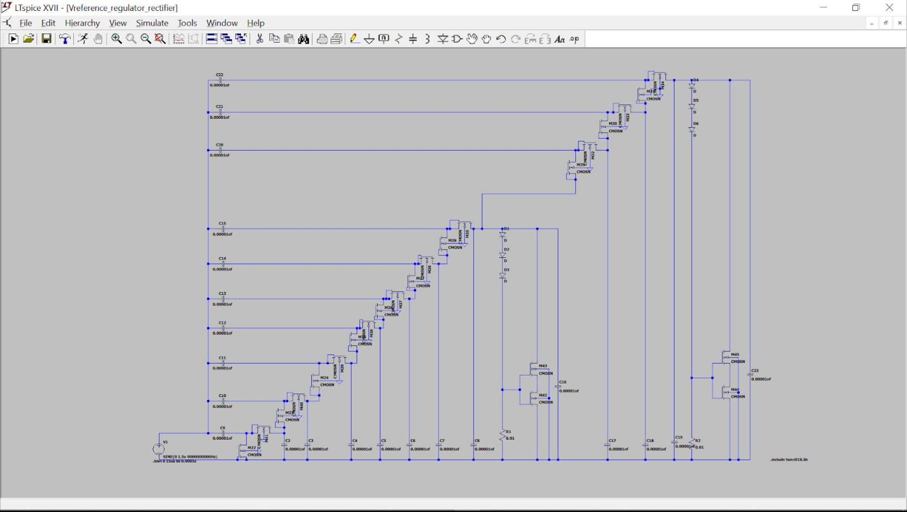
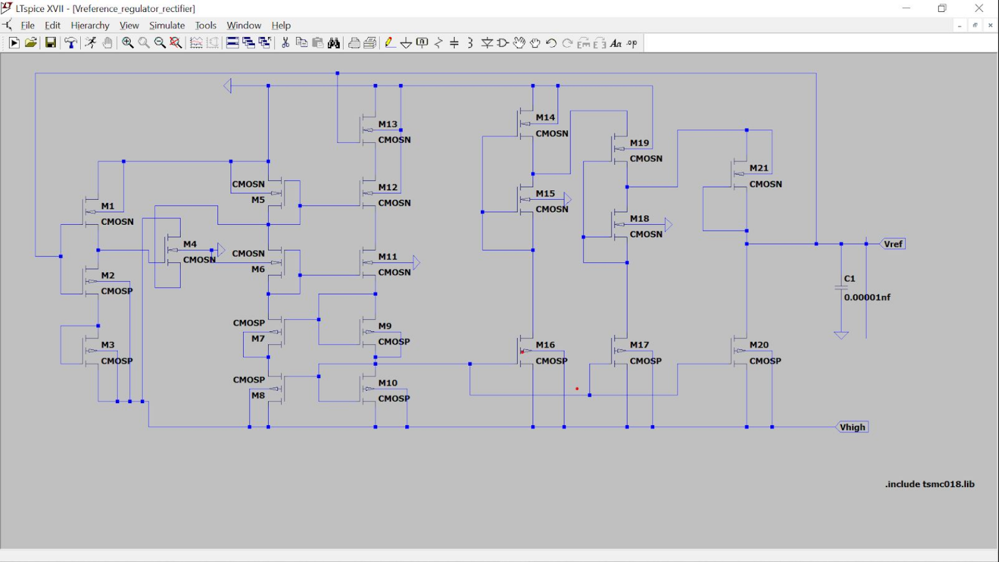
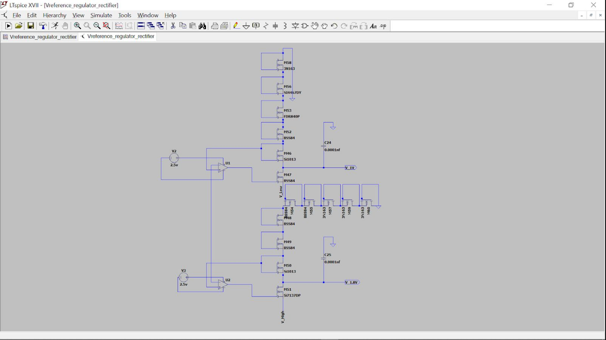
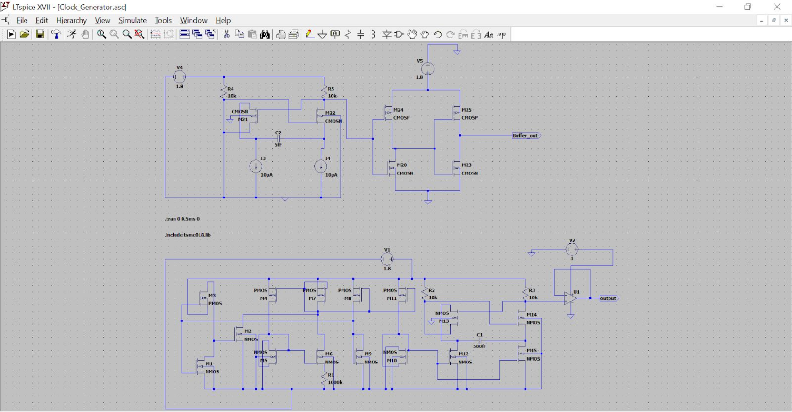
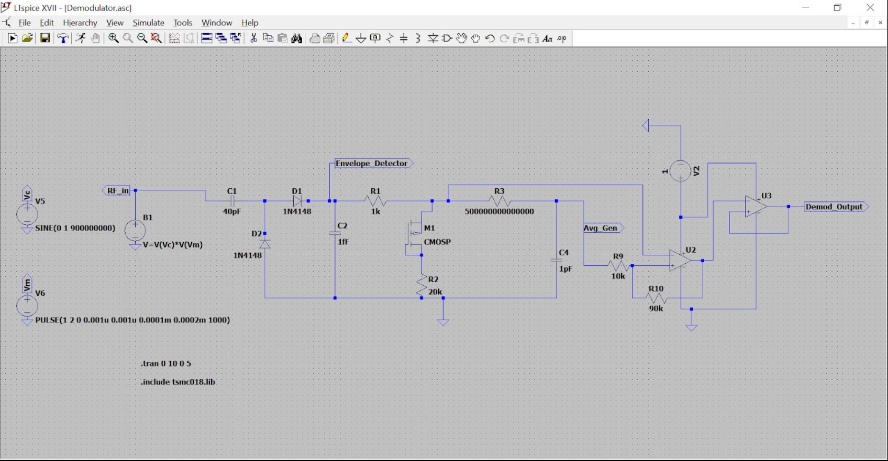

# Analog Front end for UHF RFID Tag
This repository contains the LTspice files used to analyze an analog front end of a UHF RFID tag.
UHF RFID tags mentioned in [1] contain parts of the analog front end followed by the digital back end.
We focus on the analog front end, where the given circuits are analyzed.

For more information, please go through the detailed [project report](RF_Mini_Project.pdf) as well as the [final presentation](Final_presentation.pdf). They contain the simulation outputs of each of the sections explained below.

## Table of Contents
1. [Block Diagram](#Block-diagram)
2. [Rectifier](#rectifier)
3. [Voltage Reference](#Voltage-Reference)
4. [Voltage Regulator](#Voltage-Regulator)
5. [Clock Generator](#clock-generator)
6. [ASK Demodulator](#ask-demodulator)
7. [References](#references)

## Block Diagram

The above block diagram of the analog front end consists of mainly five components. Rectifier, voltage reference, regulator, clock generator, and ASK demodulator. These are the main components required for the receiving of signals. The subsequent sections will give a small explanation of the elements mentioned above. The above diagram has been taken from [1].

## Rectifier

The rectifier implemented consists of NMos, which replaces the Schottky barrier diode from the original Dickson rectifier. This substitution reduces manufacturing costs and reduces power consumption.
The [rectifier.asc](rectifier.asc) file contains the LTspice file for the rectifier circuit.

## Voltage Reference

The voltage reference circuit is an integral part of the whole circuit. Its main goal is to take voltage sources with opposite temperature coefficients, so a voltage source that does not change with temperature is obtained. This was also designed using NMos to reduce power consumption.
The [Vreference.asc](Vreference.asc) file contains the LTspice file for the voltage reference circuit.

## Voltage Regulator

This circuit is responsible for providing stable power to the rest of the circuit, as when the distance between tag and reader changes, causing fluctuations in power. The circuit is required to have a good power supply rejection ratio.
The [Voltage_Regulator.asc](Voltage_Regulator.asc) file contains the LTspice file for the regulator.

## Clock Generator

The circuit picture compromises of 3 different parts, a start-up, a bias current reference generator, and a relaxation oscillator. There are two circuits shown in the above circuit. The top one is a straightforward interpretation of the lower one. Mosfets have been replaced with ideal voltage and current sources.
The [Clock_Generator.asc](Clock_Generator.asc) file contains the LTspice file for the clock generator.

## ASK Demodulator

Usually, an ASK demodulator consists of 2 parts: a single-stage rectifier doubler, a limiter, an LPF, and finally, a hysteresis comparator. The limiter is usually used to attenuate high RF power levels, but this part was not created as we input ideal signals. After all the stages, we get the demodulated output.
The [demodulator.asc](demodulator.asc) file contains the LTspice file for the ASK demodulator.

## References
[1] Wang Yao, Wen Guangjun, Mao Wei, He Yanli, Zhu Xueyong, et al. Design of a passive UHF RFID
tag for the ISO18000-6C protocol. IEEE J Solid-State Circuits, 2011

[2] Jianqin Qian, Chun Zhang, Liji Wu, Xijin Zhao, Dingguo Wei, Zhihao Jiang, Yuhui He, et al. A
Passive UHF Tag for RFID-based Train Axle
Temperature Measurement System

